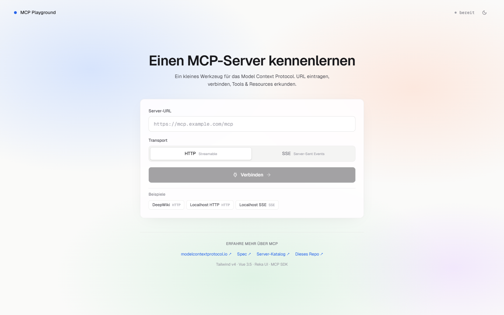
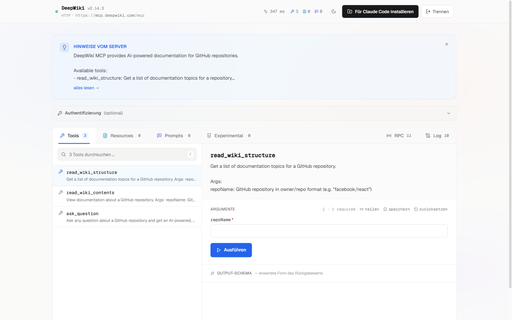
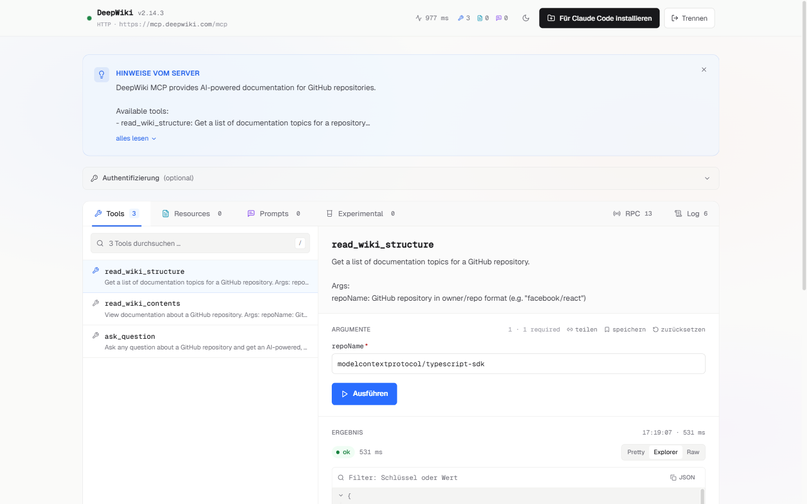
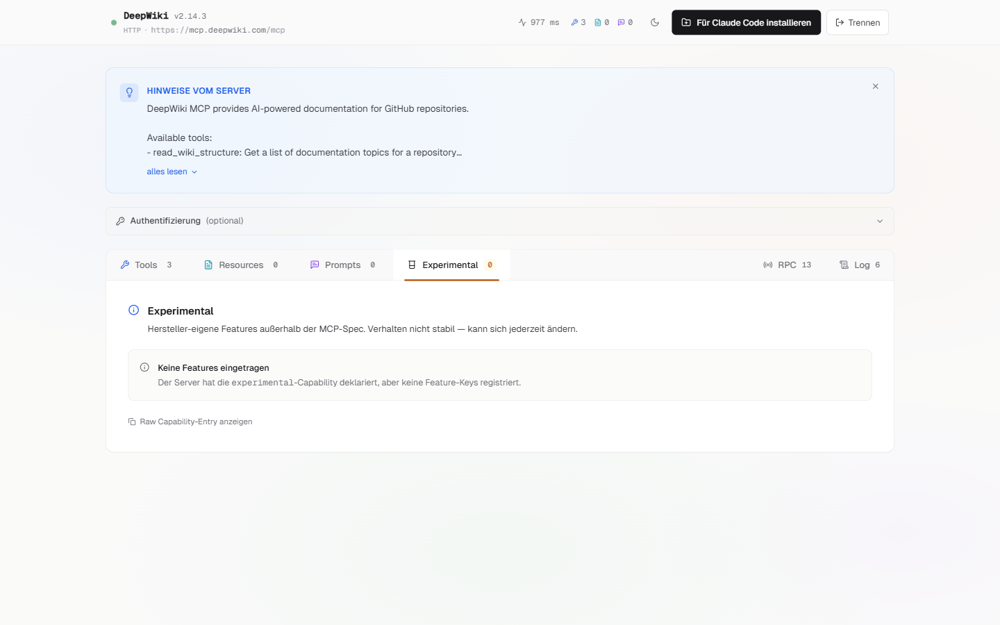
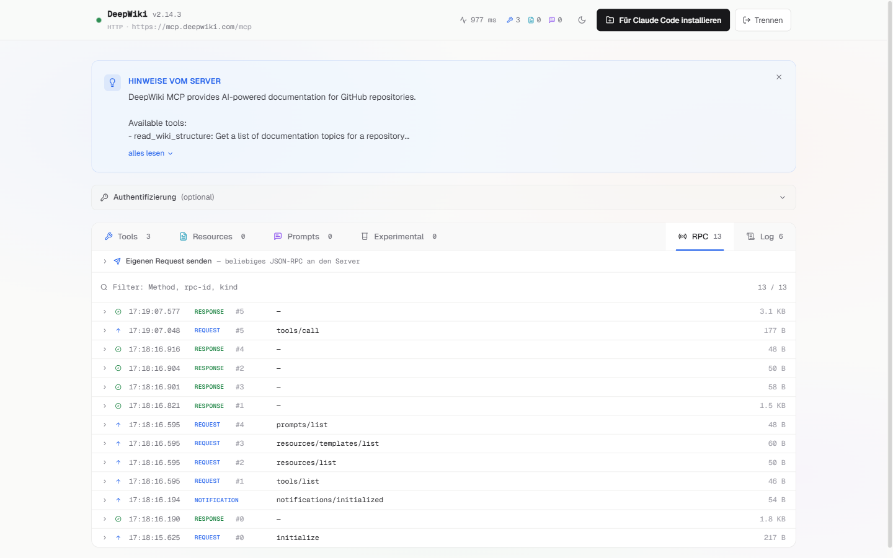

# MCP Playground

> Ein Browser-Tool zum **Erkunden und Ausprobieren von MCP-Servern** — ohne
> Command-Line, ohne Setup, einfach URL rein und los.

Verbinde dich per HTTP-Streamable oder SSE mit einem **Model Context Protocol**-Server,
browse durch Tools / Resources / Prompts, führ sie direkt aus der UI aus, sieh Live-Progress
und Ergebnisse inline. OAuth 2.1 mit Dynamic Client Registration läuft automatisch, Tool-
Ergebnisse lassen sich als JSON-Tree filtern und durchsuchen.

Deploybar auf GitHub Pages in 2 Minuten. Läuft lokal mit SSRF-gehärtetem Dev-Proxy für
Server ohne CORS.

Live: **[shroomlife.github.io/mcp-playground](https://shroomlife.github.io/mcp-playground/)**

## Screenshots

| Landing | Connected mit Tools |
|---|---|
|  |  |

| Tool-Call mit strukturiertem Ergebnis | Capability-Tab (Experimental) |
|---|---|
|  |  |



## Features

### Verbinden & Authentifizieren

- 🔌 **HTTP Streamable oder SSE** mit OAuth 2.1, Bearer-Token oder Custom Auth-Headern
- 🔐 **OAuth 2.1 + Dynamic Client Registration** — Discovery (RFC 9728), DCR (RFC 7591),
  PKCE, Token-Refresh. Kein manuelles Client-Setup, einfach "Anmelden" klicken
- 🔑 **Token-Inspektor** nach OAuth-Login — Access-/Refresh-Token, Scope, Client-ID,
  Ablauf-Countdown, fertiger `curl`-Aufruf (Token maskiert, bewusstes Kopieren)
- 🧭 **Server Preview** auf der Landing — leichtgewichtiger `initialize`-Probe zeigt
  Name, Version, Auth-Mode, bevor du verbindest
- 📚 **Zuletzt verbunden** — Server-History mit Klick-zum-Reconnect (cross-tab, `localStorage`)

### Erkunden & Ausführen

- 🔍 **Split-View Explorer** für Tools/Resources/Prompts — durchsuchbare Listen, Descriptions,
  Schemas, Ausführung inline in der Detail-Pane
- 🗂️ **Capabilities als Tabs** — Tools / Resources / Prompts immer da, `experimental` +
  `extensions` erscheinen dynamisch mit den vom Server deklarierten Feature-Keys
- ▶️ **Form → Run → Result → History** in einem Flow — kein Modal-Hopping
- 📡 **Live-Progress & Cancel** — Server-Progress-Notifications als Balken, Stop-Button für
  laufende Calls (via AbortController)
- 🌳 **3-Modi Result-Viewer** — Pretty (gerenderte Content-Blocks) / Explorer (Tree mit
  Such-Filter) / Raw (JSON-Text + Copy). Default wechselt automatisch auf Explorer bei
  JSON-Payloads
- 🧪 **Tool-History pro Tool** — alte Args per Klick zurück ins Formular laden
- 🗂️ **URI-Templates** (`/users/{id}`) mit automatischen Platzhalter-Inputs

### Next-Level

- 🔗 **Recipe-URLs** — "Share"-Button auf jedem Tool erzeugt eine URL mit vorgefüllten
  Args (`#/s/<url>?run=toolName&args=<b64>`). Empfänger kommt mit Formular schon befüllt an
- 📻 **JSON-RPC Wire-Trace Panel** — jede Request/Response/Error/Notification inkl. rpc-id,
  Richtung, Method, Size, Timestamp. Durchsuchbar, ein-/ausklappbar
- ✏️ **Manual JSON-RPC Sender** — beliebige Methoden manuell ansteuern (ping, tools/call,
  logging/setLevel, completion/complete, …) mit Methoden-Autocomplete
- 💬 **Elicitation-Support** — MCP-Elicitation-Requests werden als Dialog angezeigt
  (Form + URL-Mode), Antwort geht zurück an den Server
- 💾 **Saved Fixtures** — Tool-Calls als Presets speichern und per Klick replayen
- 📝 **Server-Logs inline** — `notifications/message` mit SERVER/CLIENT-Kennzeichnung
- 🔄 **Auto-Refresh** bei `list_changed`-Notifications

### Install & Deploy

- 📦 **Multi-Client Install** — Claude Code, Cursor, VS Code, Windsurf. Für Claude Code
  direktes Schreiben in `.mcp.json` via File-System-Access-API, sonst Snippet-Copy
- 🔐 **Auth in `.mcp.json` übernehmen** — OAuth-Token oder Bearer werden als
  `Authorization: Bearer ${ENV_VAR}` geschrieben (Default) oder optional inline mit
  Warn-Alert. Env-Var-Name wird aus dem Server-Namen automatisch vorgeschlagen
- 🔖 **URL-Routing** — jeder Server hat eine eigene URL (`#/s/mcp.deepwiki.com/mcp`),
  Browser-Back/Forward funktioniert, URLs sind shareable

### DX / UX

- 🌓 **Dark Mode** mit System-Hint, Toggle-Button, persistiert pro Browser
- 💾 **Session-Persistenz** — Tab, Selection, Suche bleiben beim F5 erhalten
  (`sessionStorage`, stirbt mit dem Tab)
- 🔐 **SSRF-gehärteter Dev-Proxy** — Cloud-Metadata-Blocks, strikte Header-Kontrolle,
  Connect-Timeout. Nur für `bun run dev`

## Quick Start

```bash
bun install
bun run dev
```

Standardmäßig auf **[http://localhost:5775](http://localhost:5775)**. URL des MCP-Servers
eintragen, Transport wählen, verbinden.

Zum Ausprobieren: `https://mcp.deepwiki.com/mcp` (HTTP) ist public und ohne Auth erreichbar.

## Commands

| Script | Zweck |
|---|---|
| `bun run dev` | Vite dev-server + eingebauter MCP-Proxy |
| `bun run typecheck` | `vue-tsc --noEmit` |
| `bun run lint` | ESLint v10 (flat config, `strict`-Preset) |
| `bun run lint:fix` | Auto-fix wo möglich |
| `bun run build` | Typecheck + Vite production build |
| `bun run preview` | Lokale Preview des Builds |

## Tech-Stack

- **Vue 3.5** mit `<script setup>` + TypeScript strict
- **Tailwind v4** (CSS-first `@theme`, keine `tailwind.config.js`)
- **Reka UI** für Tabs/Accordion/Dialog (headless, a11y)
- **@modelcontextprotocol/sdk** als Client
- **Vite 6** + **Bun** als Runtime

## Wie das alles zusammenhängt

- **Nur Browser + Dev-Proxy** — keine Server-Logik. Der Vite-Proxy leitet Requests an
  MCP-Ziele weiter, weil Browser sonst an CORS scheitern.
- **Der Proxy ist SSRF-gehärtet**: Cloud-Metadata-IPs geblockt, Request-Header
  werden auf einen engen Allowlist gestutzt, SSE-Auth läuft über einen signierten
  `x-mcp-forward-headers` Seitenkanal (weil `EventSource` keine Custom-Header setzen kann).
- **Auth-Tokens liegen im `localStorage`** pro URL — lokales Dev-Pattern, nicht für Shared-Devices.
- **Session-State im `sessionStorage`** — was du gerade tust, überlebt den Page-Reload.
- Details zur Architektur, Konventionen und Gotchas stehen in [`CLAUDE.md`](./CLAUDE.md).

## Was der Playground *nicht* tut (bewusst)

- **Kein Sampling** — der Inspector ist kein LLM-Host
- **Keine Server-Implementierung** — nur Client/Explorer
- **Keine Test-Suite** — Typecheck + Lint sind die Quality Gates
- **Kein Resource-Subscribe** — zu niche, kaum Server bieten's an

## Deployment: GitHub Pages

Einen Klick entfernt, sobald dein Repo auf GitHub liegt:

1. Neues **public** Repo auf GitHub anlegen (Name egal, z.B. `mcp-playground`)
2. Code pushen:
   ```bash
   git remote add origin https://github.com/<user>/<repo>.git
   git push -u origin main
   ```
3. In den Repo-Settings unter **Settings → Pages**:
   - **Source**: `GitHub Actions` auswählen
4. Der mitgelieferte Workflow `.github/workflows/deploy-pages.yml` läuft beim nächsten Push automatisch. Nach ~1–2 Minuten ist die App online auf
   `https://<user>.github.io/<repo>/`.

**Wichtig: Was in der GitHub-Pages-Version funktioniert (und was nicht):**

- ✅ Alle UI-Features (Tools/Resources/Prompts Explorer, History, OAuth-Flow,
  JSON-Tree, Dark Mode, Session-Persistenz)
- ✅ MCP-Server die **CORS** für Browser erlauben (typische public MCP-Server für
  Web-Clients, die der Spec folgen)
- ✅ OAuth 2.1 — der Auth-Server muss ebenfalls CORS für Browser unterstützen
  (das ist per MCP-Auth-Spec der Default)
- ❌ MCP-Server **ohne CORS** — werden vom Browser geblockt. Für die gibt's den
  Dev-Proxy in `bun run dev` lokal. Beispiel: DeepWiki (`mcp.deepwiki.com/mcp`)
  setzt keine CORS-Header → geht nur lokal.

**Routing** läuft auf GitHub Pages per Hash (`#/s/<server-url>`), damit es ohne
SPA-Fallback-Config auf jedem Static-Host funktioniert. Browser-Back/Forward
funktioniert natürlich.

**Custom Domain**: wenn du eine eigene Domain per Pages-Einstellung anschließt, editier
`.github/workflows/deploy-pages.yml` und setz `BASE_PATH: /` — dann fallen die
Repo-Subpath-Prefixe im Asset-Loading weg.

## Lokal entwickeln vs. deployed

| Scenario | Lokal (`bun run dev`) | GitHub Pages |
|---|---|---|
| MCP-Server mit CORS | ✅ | ✅ |
| MCP-Server ohne CORS | ✅ (Dev-Proxy) | ❌ (Browser-CORS-Block) |
| SSRF-Härtung | ✅ | — (nicht nötig, kein Backend) |
| OAuth Discovery/DCR | ✅ (proxied) | ✅ (direkt, wenn AS CORS hat) |
| URL-Stil | `/s/<url>` | `#/s/<url>` |

## Lizenz

MIT — siehe [LICENSE](./LICENSE). Built by [@shroomlife](https://github.com/shroomlife).
